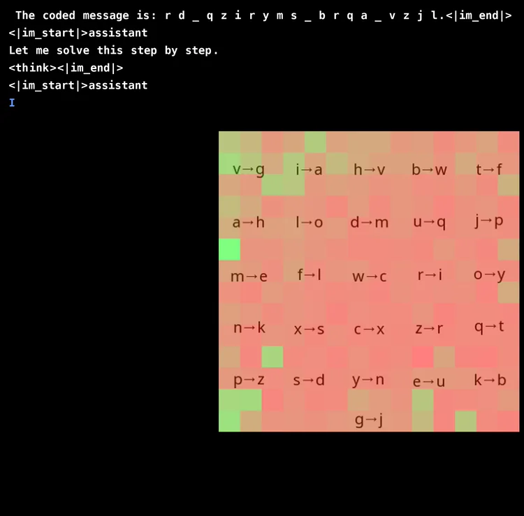

# AwesomeCode_on_LLMReasoningRL
> awesome code on LLM reasoning reinforcement learning from the beautiful world 🤯 We are not here to judge the performance of all kinds of methods; we are here to appreciate the beauty in diversity.

---
- [ReFT](https://github.com/lqtrung1998/mwp_ReFT)

ReFT: Reasoning with Reinforced Fine-Tuning ([2401.08967](https://arxiv.org/abs/2401.08967))

---
- [RLVR: Reinforcement Learning with Verifiable Rewards](https://github.com/allenai/open-instruct/blob/main/open_instruct/ppo_vllm_thread_ray_gtrl.py)

Tulu 3: Pushing Frontiers in Open Language Model Post-Training ([2411.15124](https://arxiv.org/abs/2411.15124))

---
- [PRIME](https://github.com/PRIME-RL/PRIME)

PRIME (Process Reinforcement through IMplicit REwards), an open-source solution for online RL with process rewards. This work stems from the implicit process reward modeling (PRM) objective.
built upon veRL.

---
- [PURE](https://github.com/CJReinforce/PURE)

Stop Gamma Decay: Min-Form Credit Assignment Is All Process Reward Model Needs for Reasoning. Process Reward Model (PRM) trained on PRM800K dataset can fine-tune LLM to achieve SOTA-level mathematical reasoning capabilities for < $150 (8 A100 GPUs * 16 hours).

---
- [OREAL](https://github.com/InternLM/OREAL)

Exploring the Limit of Outcome Reward for Learning Mathematical Reasoning.

---
- [TinyZero](https://github.com/Jiayi-Pan/TinyZero)

TinyZero is a reproduction of DeepSeek R1 Zero in countdown and multiplication tasks.
built upon veRL.

([Mini-R1](https://www.philschmid.de/mini-deepseek-r1#4-distributed-training-example-for-grpo-using-deepspeed-and-vllm): Philipp reproduced R1 aha moment on countdown as well. built upon trl)

---
- [open-r1](https://github.com/huggingface/open-r1)

A fully open reproduction of DeepSeek-R1.🤗

---
- [simpleRL-reason](https://github.com/hkust-nlp/simpleRL-reason)

simpleRL-reason reproduces the training of DeepSeek-R1-Zero and DeepSeek-R1 for complex mathematical reasoning, starting from Qwen-2.5-Math-7B (base model), and only using 8K (query, final answer) examples from the original MATH dataset.
built upon OpenRLHF.

---
- [STILL-3-1.5B-Preview](https://github.com/RUCAIBox/Slow_Thinking_with_LLMs/tree/main/OpenRLHF-STILL)

apply RL on DeepSeek-R1-Distill-Qwen-1.5B with 30k data (from MATH,NuminaMathCoT, and AIME 1983-2023).
built upon OpenRLHF.

---
- [Logic-RL](https://github.com/Unakar/Logic-RL)

reproduce DeepSeek R1 Zero on 2K Tiny Logic Puzzle Dataset.
built upon veRL.

---
- [deepscaler](https://github.com/agentica-project/deepscaler)

DeepScaleR-1.5B-Preview, a 1.5B model that surpasses O1-Preview and achieves 43.1% Pass@1 on AIME. They achieve this by iteratively scaling Deepseek's GRPO algorithm from 8K→16K->24K context length for thinking.
built upon veRL.

---
- [X-R1](https://github.com/dhcode-cpp/X-R1)

minimal-cost for training 0.5B R1

---
- [Sky-T1-7B](https://github.com/NovaSky-AI/SkyThought)

Sky-T1-7B, an open-recipe 7B model on math reasoning tasks, trained with 4-step SFT->RL->SFT->RL from the Qwen2.5-Math-7B base model.

---
- [simple_GRPO](https://github.com/lsdefine/simple_GRPO)

A very simple GRPO implement for reproducing r1-like LLM thinking.

---
- [CP-Zero](https://github.com/phonism/CP-Zero)

Qwen2.5-Coder-7B on Code Contest.
built upon veRL.

---
- [Open-Reasoner-Zero](https://github.com/Open-Reasoner-Zero/Open-Reasoner-Zero/)

An Open Source Approach to Scaling Up Reinforcement Learning on the Base Model.
adapt from openrlhf.

---
- [Light-R1](https://github.com/Qihoo360/Light-R1)

Curriculum SFT, DPO and RL on r1-distill/qwen models.
built upon veRL.

---
- [DAPO](https://github.com/BytedTsinghua-SIA/DAPO)

Decoupled Clip and Dynamic sAmpling Policy Optimization (DAPO) algorithm.
built upon veRL.

---
- [nick7nlp/FastCuRL/tree/main](https://github.com/nick7nlp/FastCuRL)

FastCuRL: Curriculum Reinforcement Learning with Progressive Context Extension for Efficient Training R1-like Reasoning Models.
built upon veRL.

---
- [l1](https://github.com/cmu-l3/l1)

Controlling How Long A Reasoning Model Thinks With Reinforcement Learning.
built upon veRL.

---
- [swe-rl](https://github.com/facebookresearch/swe-rl)

Advancing LLM (Llama3-70B) Reasoning via Reinforcement Learning (grpo) on Open Software Evolution.

---
- [Reason-Searcher](https://github.com/SsmallSong/Reason-Searcher)

Incentivizing the Search Capability in LLMs via Reinforcement Learning

---
- [grpo-judge-experiments-findings-and-empirical-observations/](https://kalomaze.bearblog.dev/grpo-judge-experiments-findings-and-empirical-observations/)

GRPO Judge Experiments: Findings & Empirical Observations

---
- [knoveleng/open-rs](https://github.com/knoveleng/open-rs)

focus on a 1.5-billion-parameter model, DeepSeek-R1-Distill-Qwen-1.5B, grpo trained for math on 4 NVIDIA A40 GPUs (48 GB VRAM each) within 24 hours.
built upon trl.

---
- [ReSearch](https://github.com/Agent-RL/ReSearch)

learn to Reason with Search (ReSearch)

---
- [AutoDidact](https://github.com/dCaples/AutoDidact)

Research exploring how small LLMs can autonomously enhance their own research and reasoning capabilities by generating, researching, and answering self-created question-answer pairs, learning agentic search via reinforcement learning. All running on a single RTX 4090.
built upon trl+Unsloth.

---
- [RAGEN](https://github.com/ZihanWang314/ragen)

RAGEN is a reproduction of the DeepSeek-R1(-Zero) methods for training agentic models. They run RAGEN on Qwen-2.5-{0.5B, 3B}-{Instruct, None} and DeepSeek-R1-Distill-Qwen-1.5B, on the Gym-Sokoban task.📦
built upon veRL.

---
- [VAGEN](https://github.com/RAGEN-AI/VAGEN)

VAGEN is a multi-turn reinforcement learning framework designed specifically for training VLM Agents. VAGEN leverages the TRICO algorithm to efficiently train VLMs for visual agentic tasks.
built upon veRL.

---
- [Agent-R1](https://github.com/0russwest0/Agent-R1)

employ End-to-End reinforcement learning to train agents in specific environments. Developers need only define domain-specific tools and reward functions to extend Agent-R1 to their unique use cases.
biult upon veRL.

---
- [Search-R1](https://github.com/PeterGriffinJin/Search-R1)

Through RL (rule-based outcome reward), the 3B base LLM (both Qwen2.5-3b-base and Llama3.2-3b-base) develops reasoning and search engine calling abilities all on its own.

---
- [R1-Searcher](https://github.com/SsmallSong/R1-Searcher)

utilizing a two-stage outcome-supervision reinforcement learning approach to enable the model to learn to invoke web search during the reasoning process: first allowing the model to learn how to invoke web search, and then teaching it how to effectively use that search engine.

---
- [AceCoder](https://github.com/TIGER-AI-Lab/AceCoder)

rule-based rl on large-scale coding dataset with an average of 16 test cases per prompt, synthesized by GPT-4o-mini.

---
- [SUFE-AIFLM-Lab/Fin-R1](https://github.com/SUFE-AIFLM-Lab/Fin-R1)

Qwen2.5-7B-Instruct -> sft -> grpo

---
- [open-r1-multimodal](https://github.com/EvolvingLMMs-Lab/open-r1-multimodal)

---
- [R1-V](https://github.com/Deep-Agent/R1-V)

---
- [VLM-R1](https://github.com/om-ai-lab/VLM-R1)

---
- [VisualThinker-R1-Zero](https://github.com/turningpoint-ai/VisualThinker-R1-Zero)

successfully observe the emergent “aha moment” and increased response length in visual reasoning on just a 2B non-SFT models.

---
- [MMR1](https://github.com/LengSicong/MMR1)

MMR1-Math-v0-7B,  6k high-quality samples, GRPO, uniform sampling of data based on both task difficulty (filtering out overly simple problems) and mathematical reasoning diversity.

---
- [groundlight/r1_vlm](https://github.com/groundlight/r1_vlm)

apply grpo on a small VLM to solve cryptograms.
built upon trl.

---
- [yihedeng9/OpenVLThinker](https://github.com/yihedeng9/OpenVLThinker)

 iteratively leverages supervised fine-tuning (SFT) on lightweight training data and Reinforcement Learning (RL).
 built upon verl.

---
- [Reason-RFT](https://arxiv.org/abs/2503.20752v1)

Reinforcement Fine-Tuning for Visual Reasoning. sft + grpo.

## verifier
- [huggingface/Math-Verify](https://github.com/huggingface/Math-Verify)
- [willccbb/verifiers](https://github.com/willccbb/verifiers)

## general
- [huggingface/trl](https://github.com/huggingface/trl)  ([unsloth](https://docs.unsloth.ai/basics/reasoning-grpo-rl-ppo) could reduce gpu memory requirement and speed up)
- [OpenRLHF/OpenRLHF](https://github.com/OpenRLHF/OpenRLHF)
- [volcengine/verl](https://github.com/volcengine/verl)
- [sail-sg/oat](https://github.com/sail-sg/oat)

## data (any ratable task could be applied)
- [Open Reasoning Data](https://gr.inc/)
- [synthetic-1](https://huggingface.co/datasets/PrimeIntellect/SYNTHETIC-1)
- math
  - [RLVR-GSM](https://huggingface.co/datasets/allenai/RLVR-GSM) (train:7.47k; test:1.32k)
  - [RLVR-MATH](https://huggingface.co/datasets/allenai/RLVR-MATH) (train:7.5k)
  - [NuminaMath-CoT](https://huggingface.co/datasets/AI-MO/NuminaMath-CoT) (aops_forum+amc_aime+cn_k12+gsm8k+math+olympiads+orca_math+synthetic_amc+synthetic_math) (train:859k; test:100)
  - [NuminaMath-1.5](https://huggingface.co/datasets/AI-MO/NuminaMath-1.5) (train: 896k)
  - [DeepScaleR-Preview-Dataset](https://huggingface.co/datasets/agentica-org/DeepScaleR-Preview-Dataset) (AIME+AMC+Omni-MATH+STILL) (train: 40k)
  - [Big-Math-RL-Verified](https://huggingface.co/datasets/SynthLabsAI/Big-Math-RL-Verified) (train: 251k)
  - [OpenMathInstruct-2](https://huggingface.co/datasets/nvidia/OpenMathInstruct-2) (train:14M)
- code
  - [code_contests](https://huggingface.co/datasets/deepmind/code_contests) (train:3.76k; val:117; test:165)
  - [TACO](https://huggingface.co/datasets/BAAI/TACO) (train:25k; test:1k)
  - [AceCode-89K](https://huggingface.co/datasets/TIGER-Lab/AceCode-89K) (train:87.1k)
  - [KodCode-V1](https://huggingface.co/datasets/KodCode/KodCode-V1) (train:444k)
  - [open-r1/codeforces](https://huggingface.co/datasets/open-r1/codeforces) (train: 9.56k; test:468)
  - [open-r1/ioi](https://huggingface.co/datasets/open-r1/ioi) (train: 229; test:41) ([ioi-test-cases](https://huggingface.co/datasets/open-r1/ioi-test-cases))
- puzzle
  - [https://huggingface.co/blog/yuchenlin/zebra-logic](https://huggingface.co/blog/yuchenlin/zebra-logic) (zebra-puzzle)
  - [mem-kk-logic](https://github.com/AlphaPav/mem-kk-logic/) (Knights and Knaves (K&K) puzzles)
  - [temporal-clue](https://github.com/bradhilton/temporal-clue) (Clue-inspired puzzles with temporal and spatial dimensions)
- others
  - [RLVR-IFeval](https://huggingface.co/datasets/allenai/RLVR-IFeval) (train:15k)
- mix
  - [Eurus-2-RL-Data](https://huggingface.co/datasets/PRIME-RL/Eurus-2-RL-Data) (NuminaMath-CoT+APPS+CodeContests+TACO+Codeforces+cleaning and filtering) (train:481k; val:2k)
- ...

## msg data from long-cot model (r1/qwq...)
- [NuminaMath-QwQ-CoT-5M](https://huggingface.co/datasets/PrimeIntellect/NuminaMath-QwQ-CoT-5M)
- [Bespoke-Stratos-17k](https://huggingface.co/datasets/bespokelabs/Bespoke-Stratos-17k)
- [R1-Distill-SFT](https://huggingface.co/datasets/ServiceNow-AI/R1-Distill-SFT)
- [dolphin-r1](https://huggingface.co/datasets/cognitivecomputations/dolphin-r1)
- [R1-Distill-SFT](https://huggingface.co/datasets/ServiceNow-AI/R1-Distill-SFT)
- [OpenThoughts-114k](https://huggingface.co/datasets/open-thoughts/OpenThoughts-114k)
- [SCP-116K](https://huggingface.co/datasets/EricLu/SCP-116K)
- [Magpie-Reasoning-V1-150K-CoT-QwQ](https://huggingface.co/datasets/Magpie-Align/Magpie-Reasoning-V1-150K-CoT-QwQ)
- [Magpie-Reasoning-V1-150K-CoT-Deepseek-R1-Llama-70B](https://huggingface.co/datasets/Magpie-Align/Magpie-Reasoning-V1-150K-CoT-Deepseek-R1-Llama-70B)
- [function-calling-v0.2-with-r1-cot](https://huggingface.co/datasets/AymanTarig/function-calling-v0.2-with-r1-cot)
- [s1K](https://huggingface.co/datasets/simplescaling/s1K)   (It seems that it includes some eval set (such as OmniMath) ???🤯)
- [OpenR1-Math-220k](https://huggingface.co/datasets/open-r1/OpenR1-Math-220k)
- [Chinese-DeepSeek-R1-Distill-data-110k](https://huggingface.co/datasets/Congliu/Chinese-DeepSeek-R1-Distill-data-110k)
- [Primus-Reasoning](https://huggingface.co/datasets/trendmicro-ailab/Primus-Reasoning)
- [STILL](https://github.com/RUCAIBox/Slow_Thinking_with_LLMs/tree/main/data)
- [KodCode-V1-SFT-R1](https://huggingface.co/datasets/KodCode/KodCode-V1-SFT-R1)
- [open-r1/codeforces-cots](https://huggingface.co/datasets/open-r1/codeforces-cots)
- [open-r1/ioi-cots](https://huggingface.co/datasets/open-r1/ioi-cots)
- [glaiveai/reasoning-v1-20m](https://huggingface.co/datasets/glaiveai/reasoning-v1-20m)

## model weigts
- [QwQ-32B-Preview](https://huggingface.co/Qwen/QwQ-32B-Preview)
- [DeepSeek-R1 series](https://huggingface.co/collections/deepseek-ai/deepseek-r1-678e1e131c0169c0bc89728d)
- [sky-t1-7b](https://huggingface.co/collections/NovaSky-AI/sky-t1-7b-67ab281da8192c1ba3e5296c)
- [RekaAI/reka-flash-3](https://huggingface.co/RekaAI/reka-flash-3)
- [nvidia/Llama-3_3-Nemotron-Super-49B-v1](https://huggingface.co/collections/nvidia/llama-nemotron-67d92346030a2691293f200b)

## others
- [Reasoning Datasets](https://huggingface.co/collections/philschmid/reasoning-datasets-679f57ff20e5b46b4ef4d3dd)
- [RL with Better Cold-Start Strategies](https://github.com/liziniu/cold_start_rl)
- [Learning to Reason at the Frontier of Learnability](https://arxiv.org/pdf/2502.12272)
- [Reasoning-Attack](https://github.com/PKU-YuanGroup/Reasoning-Attack/tree/master)
- [Teaching Language Models to Solve Sudoku Through Reinforcement Learning](https://hrishbh.com/teaching-language-models-to-solve-sudoku-through-reinforcement-learning/)

