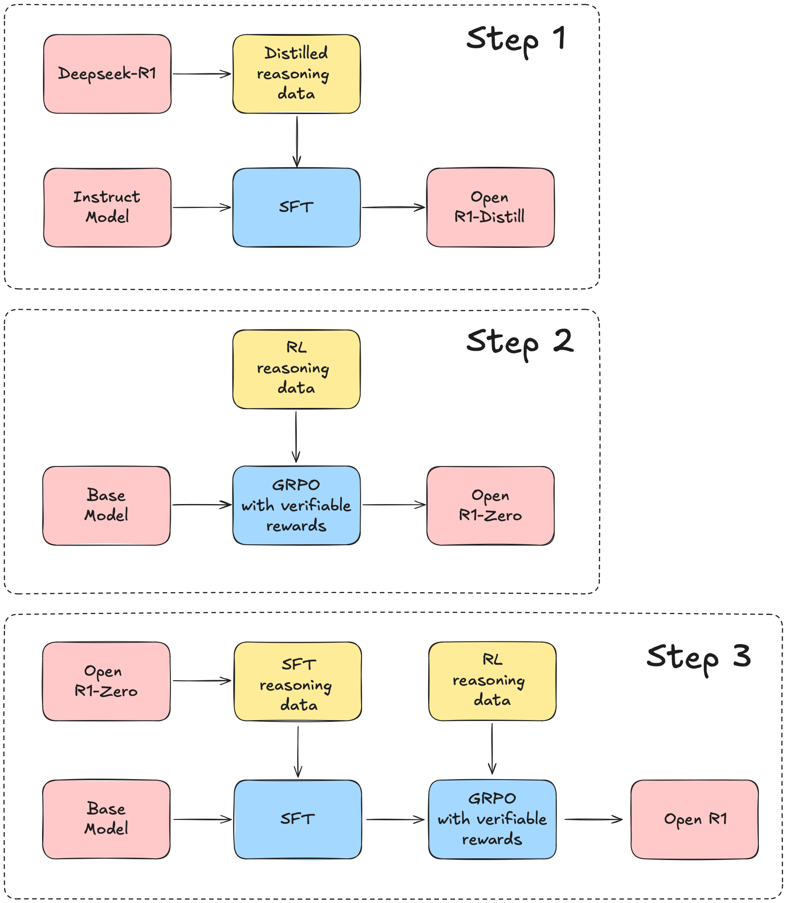

# AwesomeCode_on_LLMReasoningRL
> awesome code on LLM reasoning reinforcement learning from the beautiful world 🤯 We are not here to judge the performance of all kinds of methods; we are here to appreciate the beauty in diversity.

---
- [ReFT](https://github.com/lqtrung1998/mwp_ReFT)

ReFT: Reasoning with Reinforced Fine-Tuning ([2401.08967](https://arxiv.org/abs/2401.08967))

---
- [RLVR: Reinforcement Learning with Verifiable Rewards](https://github.com/allenai/open-instruct/blob/main/open_instruct/ppo_vllm_thread_ray_gtrl.py)

Tulu 3: Pushing Frontiers in Open Language Model Post-Training ([2411.15124](https://arxiv.org/abs/2411.15124))

---
- [PRIME](https://github.com/PRIME-RL/PRIME)

PRIME (Process Reinforcement through IMplicit REwards), an open-source solution for online RL with process rewards. This work stems from the implicit process reward modeling (PRM) objective.
built upon veRL.

---
- [TinyZero](https://github.com/Jiayi-Pan/TinyZero)

TinyZero is a reproduction of DeepSeek R1 Zero in countdown and multiplication tasks.
built upon veRL.

([Mini-R1](https://www.philschmid.de/mini-deepseek-r1#4-distributed-training-example-for-grpo-using-deepspeed-and-vllm): Philipp reproduced R1 aha moment on countdown as well. built upon trl)

---
- [open-r1](https://github.com/huggingface/open-r1)

A fully open reproduction of DeepSeek-R1.🤗

---
- [simpleRL-reason](https://github.com/hkust-nlp/simpleRL-reason)

simpleRL-reason reproduces the training of DeepSeek-R1-Zero and DeepSeek-R1 for complex mathematical reasoning, starting from Qwen-2.5-Math-7B (base model), and only using 8K (query, final answer) examples from the original MATH dataset.
built upon OpenRLHF.

---
- [STILL-3-1.5B-Preview](https://github.com/RUCAIBox/Slow_Thinking_with_LLMs/tree/main/OpenRLHF-STILL)

apply RL on DeepSeek-R1-Distill-Qwen-1.5B with 30k data (from MATH,NuminaMathCoT, and AIME 1983-2023).
built upon OpenRLHF.

---
- [RAGEN](https://github.com/ZihanWang314/ragen)

RAGEN is a reproduction of the DeepSeek-R1(-Zero) methods for training agentic models. They run RAGEN on Qwen-2.5-{0.5B, 3B}-{Instruct, None} and DeepSeek-R1-Distill-Qwen-1.5B, on the Gym-Sokoban task.📦
built upon veRL.

## verifier
- [huggingface/Math-Verify](https://github.com/huggingface/Math-Verify)

## rl framework
- [huggingface/trl](https://github.com/huggingface/trl)
- [OpenRLHF/OpenRLHF](https://github.com/OpenRLHF/OpenRLHF)
- [volcengine/verl](https://github.com/volcengine/verl)

## data (any ratable task could be applied)
- math
  - [RLVR-GSM](https://huggingface.co/datasets/allenai/RLVR-GSM)
  - [RLVR-MATH](https://huggingface.co/datasets/allenai/RLVR-MATH)
  - [NuminaMath-CoT](https://huggingface.co/datasets/AI-MO/NuminaMath-CoT)
- code
  - [code_contests](https://huggingface.co/datasets/deepmind/code_contests)
  - [TACO](https://huggingface.co/datasets/BAAI/TACO)
- others
  - [RLVR-IFeval](https://huggingface.co/datasets/allenai/RLVR-IFeval)
- mix
  - [Eurus-2-RL-Data](https://huggingface.co/datasets/PRIME-RL/Eurus-2-RL-Data) (NuminaMath-CoT+APPS+CodeContests+TACO+Codeforces+cleaning and filtering)
- ...

## msg data from long-cot model (r1/qwq...)
- [NuminaMath-QwQ-CoT-5M](https://huggingface.co/datasets/PrimeIntellect/NuminaMath-QwQ-CoT-5M)
- [Bespoke-Stratos-17k](https://huggingface.co/datasets/bespokelabs/Bespoke-Stratos-17k)
- [R1-Distill-SFT](https://huggingface.co/datasets/ServiceNow-AI/R1-Distill-SFT)
- [dolphin-r1](https://huggingface.co/datasets/cognitivecomputations/dolphin-r1)
- [R1-Distill-SFT](https://huggingface.co/datasets/ServiceNow-AI/R1-Distill-SFT)
- [OpenThoughts-114k](https://huggingface.co/datasets/open-thoughts/OpenThoughts-114k)
- [SCP-116K](https://huggingface.co/datasets/EricLu/SCP-116K)
- [Magpie-Reasoning-V1-150K-CoT-QwQ](https://huggingface.co/datasets/Magpie-Align/Magpie-Reasoning-V1-150K-CoT-QwQ)
- [Magpie-Reasoning-V1-150K-CoT-Deepseek-R1-Llama-70B](https://huggingface.co/datasets/Magpie-Align/Magpie-Reasoning-V1-150K-CoT-Deepseek-R1-Llama-70B)
- [function-calling-v0.2-with-r1-cot](https://huggingface.co/datasets/AymanTarig/function-calling-v0.2-with-r1-cot)
- [s1K](https://huggingface.co/datasets/simplescaling/s1K)   (It seems that it includes some eval set (such as OmniMath) ???🤯)

## others
- [Reasoning Datasets](https://huggingface.co/collections/philschmid/reasoning-datasets-679f57ff20e5b46b4ef4d3dd)

